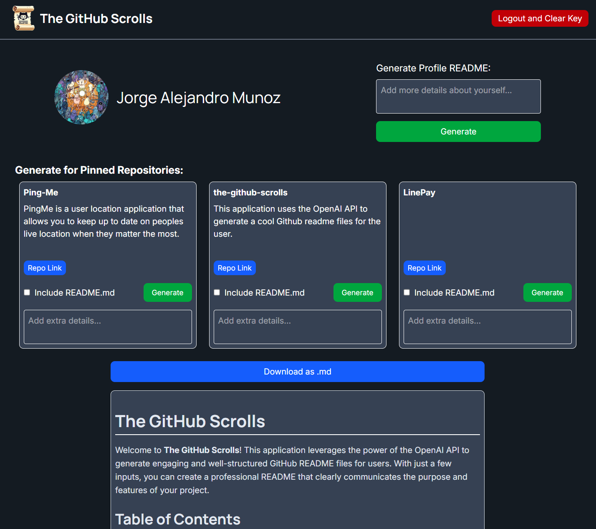

The following text was generated by this application:

# GitHub Readme Generator



## Description

GitHub Readme Generator is a web application that harnesses the power of the ChatGPT API to help users create an impressive GitHub profile README. Whether you're a beginner trying to make your profile stand out or an experienced user looking for a quick way to refresh your README, this app is designed to help you achieve that effortlessly.

## Features

- **Easy to Use**: A user-friendly interface that guides you through the process of generating a professional README.
- **Customizable**: Tailor the README to match your personal style and preferences.
- **Powered by AI**: Leverages the capabilities of the ChatGPT API for intelligent content generation.

## Getting Started

### Prerequisites

Before you can run the application, you'll need:

- A GitHub access token. You can generate one by following the instructions in the [GitHub documentation](https://docs.github.com/en/authentication/keeping-your-account-and-data-secure/creating-a-personal-access-token).
- An OpenAI API key. Register for an API key on the [OpenAI website](https://platform.openai.com/signup/).

### Installation

1. **Clone the repository:**

   ```bash
   git clone https://github.com/yourusername/github-readme-generator.git
   cd github-readme-generator
   ```

2. **Install the dependencies:**

   ```bash
   pnpm install
   ```

3. **Set up environment variables:**

   Create a `.env` file in the root of your project and add your GitHub access token and OpenAI API key:

   ```plaintext
   GITHUB_TOKEN=your_github_token_here
   OPENAI_API_KEY=your_openai_api_key_here
   ```

### Running the Application

To start the application, run:

```bash
pnpm run dev
```

The application will start in development mode and can be accessed at `http://localhost:3000`.

## Usage

1. Open the application in your browser.
2. Follow the on-screen instructions to input your preferences.
3. Generate a customized README for your GitHub profile.

## Contributing

Contributions are welcome! Please fork the repository and submit a pull request with your improvements. 

## License

This project is licensed under the MIT License. See the [LICENSE](LICENSE) file for details.

## Acknowledgements

- [OpenAI](https://openai.com) for providing the ChatGPT API.
- [GitHub](https://github.com) for the platform and API support.

---

Feel free to reach out with any questions or suggestions. Happy coding!